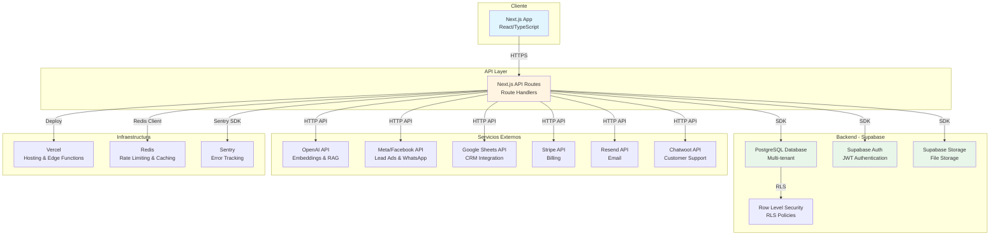
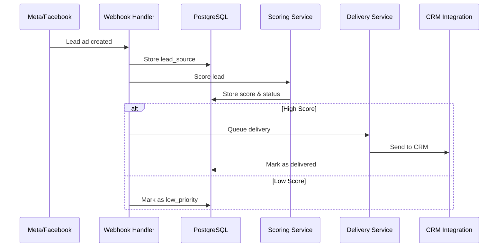
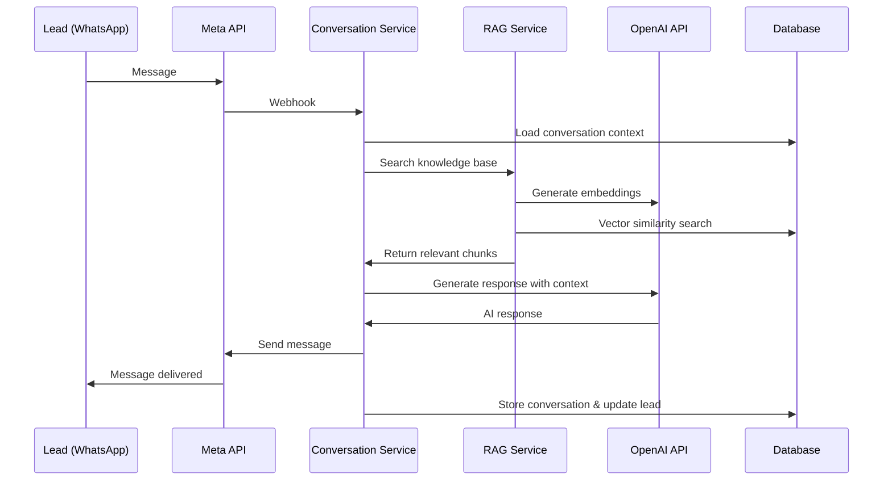
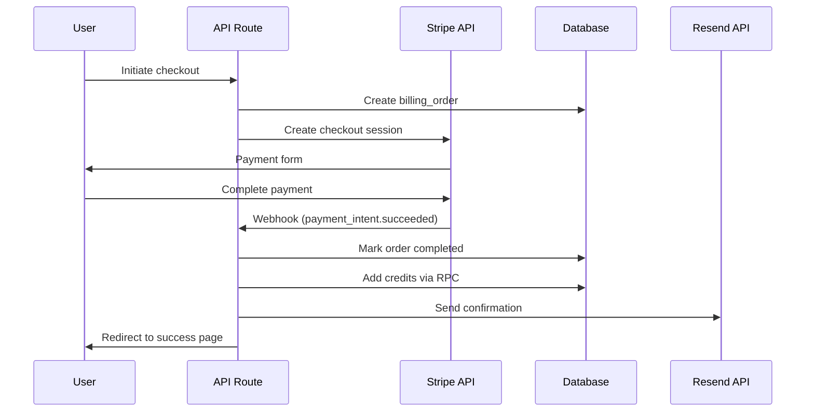
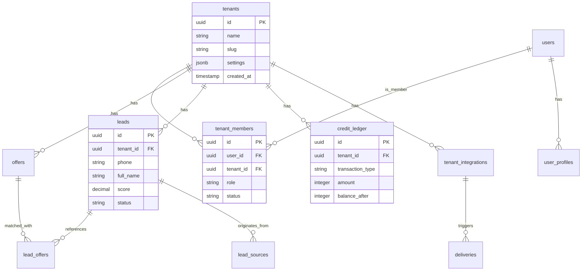
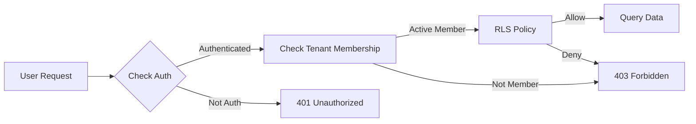

# Arquitectura de Converzia

Este documento describe la arquitectura general del sistema Converzia, una plataforma multi-tenant de calificación de leads para el sector inmobiliario.

## Vista General

Converzia es una aplicación Next.js full-stack que utiliza Supabase como backend (PostgreSQL + Auth + Storage) y varias integraciones externas para gestionar leads, conversaciones y notificaciones.

## Diagrama de Arquitectura General

## Flujo de Datos: Lead Generation

## Flujo de Datos: Conversación con Lead

## Flujo de Datos: Billing & Credits

## Modelo de Datos Multi-tenant

## Seguridad y Aislamiento de Datos

### Row Level Security (RLS)

Todas las tablas principales tienen políticas RLS para garantizar el aislamiento multi-tenant:

1. **Política base**: Usuarios solo pueden acceder a datos de sus tenants activos
2. **Política admin**: Admins de Converzia pueden acceder a todos los datos
3. **Política por rol**: Algunas operaciones requieren roles específicos (OWNER, ADMIN)

### Capas de Seguridad

1. **Nivel 1 - Autenticación**: Supabase Auth con JWT
2. **Nivel 2 - Autorización**: Tenant membership validation
3. **Nivel 3 - RLS**: Database-level row filtering
4. **Nivel 4 - API Validation**: Zod schemas + rate limiting

## Componentes Principales

### Frontend (Next.js App Router)

- **Pages**: Server Components para renderizado inicial
- **Components**: Client Components para interactividad
- **Hooks**: React Query para data fetching y caching
- **Utils**: Helpers compartidos (normalizePhone, logger, etc.)

### Backend (API Routes)

- **Handlers**: Route handlers para endpoints REST
- **Services**: Lógica de negocio (scoring, delivery, conversation)
- **Supabase Client**: Cliente configurado con RLS
- **Error Handling**: Centralizado con `handleApiError`

### Database (PostgreSQL)

- **Tables**: Tablas principales con RLS
- **Functions**: RPC functions para lógica compleja
- **Views**: Materialized views para performance
- **Migrations**: Versionado de schema

## Integraciones

### Meta/Facebook

- **Lead Ads**: Webhook para recibir leads
- **Marketing API**: Gestionar anuncios y métricas
- **WhatsApp Business API**: Enviar mensajes a leads

### OpenAI

- **Embeddings**: Vector embeddings para RAG
- **Chat Completions**: Generación de respuestas conversacionales

### Google Sheets

- **CRM Integration**: Exportar leads a Google Sheets

### Stripe

- **Checkout**: Sesiones de pago para créditos
- **Webhooks**: Confirmación de pagos

## Performance y Optimización

### Estrategias Implementadas

1. **Materialized Views**: `tenant_stats_mv` para dashboards rápidos
2. **Query Timeouts**: Todas las queries tienen timeouts configurados
3. **Indexes**: Índices en columnas frecuentemente consultadas
4. **Connection Pooling**: Supabase maneja pooling automáticamente

### Caching

- **React Query**: Cache de queries en frontend
- **Redis**: Rate limiting y cache temporal (opcional)

## Monitoreo y Observabilidad

### Logging

- **Structured Logging**: Logger centralizado con niveles (debug, info, warn, error)
- **PII Masking**: Automático en logs
- **Context**: Tenant ID, User ID, Request ID en todos los logs

### Error Tracking

- **Sentry**: Captura de errores con contexto completo
- **Error Boundaries**: React Error Boundaries en todas las páginas
- **API Error Handler**: Manejo centralizado de errores

### Audit Logging

- **Audit Table**: `audit_logs` para compliance
- **Critical Actions**: Logging de acciones importantes (tenant creation, credit purchases, GDPR deletions)

## Deployment

### Vercel

- **Edge Functions**: API routes ejecutadas en edge
- **Static Assets**: Archivos estáticos en CDN
- **Environment Variables**: Configuración por ambiente

### Cron Jobs

- **Vercel Cron**: Tareas programadas (refresh materialized views, credit alerts)
- **Daily Tasks**: Procesamiento batch

## Escalabilidad

### Horizontal Scaling

- **Stateless API**: Todas las API routes son stateless
- **Database Connection Pooling**: Manejado por Supabase
- **CDN**: Assets estáticos servidos desde CDN

### Vertical Scaling

- **Database**: Supabase maneja escalado automático
- **Compute**: Vercel escala automáticamente según demanda

## Próximas Mejoras

- [ ] Implementar caching más agresivo con Redis
- [ ] Añadir WebSockets para notificaciones en tiempo real
- [ ] Migrar a Server Actions de Next.js donde sea apropiado
- [ ] Implementar CDN para assets de storage
- [ ] Añadir GraphQL API layer opcional
